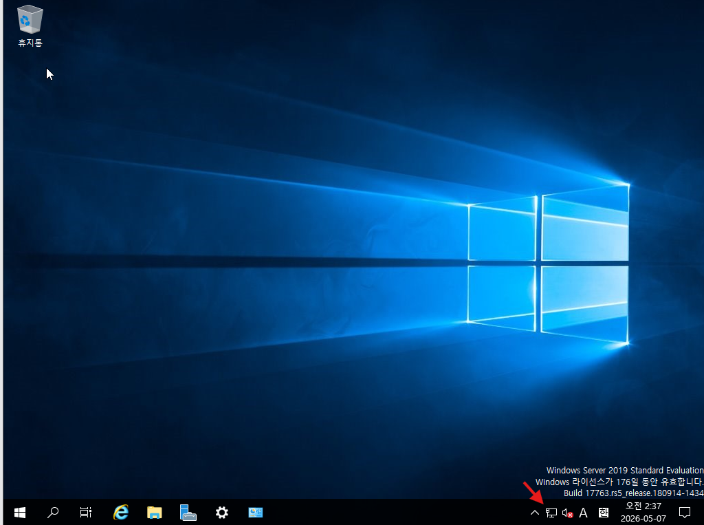

# 윈도우 (2019) 스터디 2주차

## Windows Server 2019 Study Week2

### Windows Server 2019 네트워크 및 PowerShell 기초

- PowerShell을 활용한 네트워크 상태 확인
    - 고정 IP 설정 , 게이트웨이 DNS 서버 지정
    1. 밑에 상태 표시줄에서 네트워크를 찾아서 마우스 우클릭을 해서 네트워크 및 인터넷 설정 열기를 클릭한다 ( 만약 인터넷이 연결이 안된 상태라면 지구본 같은 표시가 나올텐데 그거를 우클릭하면 된다 )
        
        
        
        
        
    2. 어탭터 옵션 변경을 클릭한다.
        
        
        
    
    1. 네트워크 연결 창이 나오는데 변경하고자 하는 곳을 우클릭 후 속성탭에서 수정이 가능하다.
        
        
        
    
    1. 속성탭이 뜨면 Internet Protocol Version 4 (TCP/IPv4) 클릭 후 속성 버튼을 클릭한다.
        
        
        
    
    1. 처음에는 자동으로 IP 주소 받기로 체크가 되어 있었는데 IP 를 고정하고 싶으면 다음 IP 주소 사용을 클릭하고 입력한다.
        
        
        
    
    1. 고정 IP 를 설정한 다음 핑 테스트를 진행을 해봐야 한다(내부, 외부 다 확인해봐야 함)
        1. 고정 IP가 제대로 적용됐는지 확인하기 위해서
        2. 같은 네트워크 안에서 통신이 되는지 확인하기 위해서
        3. 외부 인터넷과 DNS가 정상인지 확인하기 위해서
        
        <자기 자신에게 핑을 날려서 정상인지 확인>
        
        
        
        <외부와도 통신이 되는지 확인>
        
        
        
    
    - ipconfig /all 하는 이유 : 간단하게 설명을 한다면 Windows Server에 설정된 네트워크 정보가 정확하게 적용됐는지 확인하기 위해서이고 조금 더 구체적으로 설명을 한다면…
        - 고정 IP 가 제대로 들어갔는지 확인하기 위해
        - 서브넷 마스크가 맞는지 확인하기 위해
        - 기본 게이트웨이가 맞는지 확인하기 위해
        
        
        
    
    - tracert 를 사용하는 이유 : 목적지까지 네트워크가 어떤 경로를 거쳐 가는지 확인하기 위해
        - ping 은 목적지와 통신이 되는지만 확인하지만, tracert 는 중간 경로까지 확인할 수 있다
        
        < ping 을 했을 경우 >
        
        
        
        < tracert 를 했을 경우 >
        
        
        
        - 송규석님의 PC로 ping도 보내보고 tracert로 경로도 추적해봤습니다.
        
        
        
        
        
    - nslookup 을 사용하는 이유 : DNS 가 정상적으로 동작하는지 확인하기 위해
        
        
        
        - 위에 Server 와 Address 는 Windows Server가 DNS 조회를 요청한 대상 DNS 서버를 말한다.
        - Non-authoritative answer 는 내가 직접 [google.com](http://google.com) 의 원본 DNS 서버에서 받은 답변이 아니라 중간 DNS 서버가 대신 조회해서 알려준 답변이라는 뜻
        - 중간 서버가 알려줬지만 결과는 정상 변환됐기 때문에 DNS 조회는 성공했다고 보면 된다.
        - nslookup을 통해 naver 와 google, 우리 학교의 DNS도 조회를 해봤습니다.
        
        
        
        
        
    
    - netstat 를 사용하는 이유 : 어떤 포트가 열려 있고 , 어떤 서비스가 포트를 사용 중인지 확인하기 위해
        
        
        
        - 조회를 할 때 -ano 옵션을 사용하였습니다.
            - -a : 모든 연결과 대기중인 포트 표시
            - -n : 주소와 포트 번호를  숫자로 표시
            - -o : 해당 연결을 소유한 프로세스ID, 즉 PID 표시
        - 그래서 netstat -ano 는 현재 연결 상태 , 열려 있는 포트 , 상대방 IP 와 포트 , 연결 상태 , 해당 연결을 사용하는 PID 를 한 번에 보여준다.
        
        - netstat -nabo로 조금 더 상세한 결과를 출력해봅니다.
        
        | 옵션 | 의미 |
        | --- | --- |
        | n | 주소와 포트 번호를 숫자로 표시 |
        | a | 모든 연결과 대기중인 포트 표시 |
        | b | 해당 연결을 소유한 프로세스ID, 즉 PID 표시 |
        | o | PID표시 |
        
        
        
        여기서는 조금더 자세한 정보와 svchost.exe와 같은 항목들을 확인할 수 있습니다. 여기서 o와 b의 차이점을 확인할 수 있습니다.
        
        o를 입력했을 경우 PID만 출력해줍니다. b를 입력했을 경우에는 실행 파일 이름을 바로 보여줍니다. 그래서 간단하게 확인할때는 netstat-ano가 유용할 것이고, 처음부터 실행파일까지 전부 확인하고 싶다면 netstat -nabo로 입력하면 좋을 것 같습니다.
        
    
    - PID 란 ? **Process ID**
        - Windows 나 LInux 에서 실행 중인 프로그램마다 고유한 번호가 붙는데 그 번호가 PID
    
    - Test-NetConnection 를 사용하는 이유 : Windows Server가 외부 네트워크와 통신 가능한지 테스트하기 위해서
        - ping 으로 체크하면 더 빨리 끝나는데 왜 사용할까…? 그 이유는 핑보다 더 많은 네트워크 정보를 보여주기 때문이다.
        - 그래서 어떤게 차이가 있냐면
            - ping 은 상대방이 응답하는지 , 응답시간이 얼마인지 , 패킷 손실이 있는지만 알려준다
            - Test-NetConnection 은 접속 대상 도메인 , 변환된 IP 주소 , 내가 사용한 네트워크 어뎁터 , 내 출발지 IP 주소 , PIng 성공 여부 , 응답 시간
        
        
        
        - 접속 대상 도메인
        ComputerName : [internetbeacon.msedge.net](http://internetbeacon.msedge.net/)
        - 변환된 IP 주소
        RemoteAddress : 13.107.4.52
        - 내가 사용한 네트워크 어댑터
        InterfaceAlias : Ethernet1
        - 내 출발지 IP 주소
        SourceAddress : 192.168.0.155
        - Ping 성공 여부
        PingSucceeded : True
        - 응답시간
            
            PingReplyDetails (RTT) : 169 ms
            
        
        ⇒ 여기서 궁금한 부부은 NAT 가 있고 Bridge 도 있는데 계속 Bridge가 출발지 주소가 되는 현상을 찾아보았다.
        
        - Bridge 와 NAT 가 있어도 실제 통신은 둘 중 하나로 나가고 보통은 아래 기준으로 선택한다
        1. 기본 게이트웨이가 있는 인터페이스
            1. Bridge 어댑터에 기본 게이트웨이가 있고 NAT 어댑터에는 없거나 우선순위가 낮으면 Bridge로 나간다
        2. 라우팅 우선순위 , 즉 Metric 값
            1. Get-NetRoute -DestinationPrefix "0.0.0.0/0” 이 명령어를 통해서 조회할 수 있음
            2. 둘 다 Gateway 가 있으면 Windows 는 Metric 값이 더 낮은 경로를 우선 사용 ( Metric 이 낮을수록 우선순위가 높음 )
            3. Bridge 쪽이 RouteMetric 이 낮기 때문에 우선순위로 출발지 주소가 된거였음.
            
            
            
        
        - Metric 은 또 어떤거인지 궁금해서 찾아보았는데 Metric 이란 CPU , 메모리 , 디스크 , 네트워크 등 서버 자원 사용량과 성능 데이터를 측정하는 지표라고 합니다.
            - Metric 우선순위가 결정되는 과정 → 대부분 WIndows 가 자동으로 정하지만 아래 기준으로 대략 정한다고 한다.
            1. 링크 속도
            2. 어댑터 상태
            3. 기본 게이트웨이 존재 여부
            4. 자동 메트릭 설정
            5. 수동으로 설정한 Metric 값
            6. 라우팅 테이블의 경로 우선 순위
        
    - Get-NetAdapter 를 사용하는 이유 : 네트워크 어탭터 이름 , 랜카드가 정상 연결되었는지 , MAC 주소 , 링크 속도를 확인하기 위해 사용한다.
        
        
        
        - Name : 네트워크 어댑터 이름을 나타내는 부분
            - 현재 Ethernet0 , Ethernet1 이렇게 있음
        - MacAddress : 맥 주소를 나타내는 부분
            - 둘 다 정상 조회되고 있음
        - ifIndex ( Interface Index ) : 네트워크 어댑터의 고유 번호
            - 둘 다 정상 조회되고 있음
        - Status : 랜카드가 정상 연결되어 있고 사용 가능한 상태인지 확인하는 부분
            - Up 이라고 표시가 되어 있으면 사용 가능한 상태를 의미한다.
        - LinkSpeed : 네트워크 어댑터가 연결된 장비와 협상한 최대 링크 속도 즉, 해당 랜카드가 스위치나 공유기와 몇 Gbps 속도로 연결되어 있는지 나타내는 부분
            - 둘 다 조회되고 있음
- Windows Server 2019 Desktop Mode
    
    
    오늘은 기본적인 네트워크 환경을 확인해볼 뿐만 아니라, 원격 관리 실습을 진행해볼 예정입니다.
    
    왜나하면 무릇 서버엔지니어라면 서버를 원격 관리하는 경우가 대부분이기 때문입니다.~~(교수님말씀)~~
    
    이제 기존 포트 연결 포트 상태를 테스트 해봅니다. 
    
    test-netconnection 명령어와 get-netadapter 명령어로 포트 연결상태와 어댑터 연결상태를 확인합니다. 이후  Enable-PSRemoting 명령어를 통해 WinRM 을 활성화 시킵니다.
    
    
    
    원격 서버에 세션을 연결하기 위해 사전 작업이 필요합니다. 어떤 ip, 어떤 계정으로 원격 접근을 시도할 것인지를 지정해야 합니다.
    
    그래서 우리 같은 스터디 그룹의 2022 server로 원격 접속하기 위해서 targetIP 를 지정해줍니다. 그리고 get-credential을 통해 2022 server desktop님의 계정 정보를 저장하기 cred를 저장합니다.
    
    (보안상으로 IP, 계정ID, 비밀번호를 직접 입력하지 않는 것이 좋다고도 합니다.)
    
    
    
    성공적으로  원격접속이 완료되었습니다. 이제 이 PC(규석님의 PC)는 제껍니다.
    
    
    
    아래는 수많은 원격접속 시도의 흔적입니다. $targetip, $cred 입력을 하고 싶지 않아 대소문자도 바꿔보고, 마지막에 ip를 변경하자, 자격증명 요청창이 떴습니다. 마지막에는 다된 줄 알았습니다.
    
    
    
    어림도 없지.
    
    
    
    그래서 targetip도 설정해줬습니다.
    
    다음으로는 get-service 명령어를 통해 실행중인 서비스 목록을 확인해봅니다. Desktop 모드라 core모드와는 다르게 반드시 필요한 서비스 외에 다른 서비스들이 보입니다. 
    
    
    
    우선 DHCP를 중단 혹은 재시작을 시도해봅니다. DHCP는 중지가 불가능한 프로그램이라 중단 혹은 재시작이 안됩니다.
    
    
    
    아래쪽에 print spooler라는 프로그램이 있습니다. 이 프로그램은 print 설치 시 인쇄 관리를 관리하는 프로그램입니다. 지금 당장은 딱히 필요 없어 보입니다.
    
     그래서 stop-service spooler 라는 명령어로 print spooler를 중단시켜봅니다. 그 결과 running중인 프로그램 목록에서 제거되었습니다. 
    
    
    
    다시 restart-service spooler 명령어로 프로그램을 재시작합니다.
    
    
    
    다음은 desktop모드에서 2022 server core mode(192.168.0.110)로 원격접속을 시도해 봅니다. 다시 처음부터 확인을 해봅니다.
    
    
    
    이번에는 targetip와 credential을 미리 지정합니다. 이번에는 특정 IP를 신뢰가능한 원격대상으로 설정하여 실습환경을 더욱 원활하게 조성을 해봅니다.
    
    `set-item wsman:\localhost\client\trustedhosts -value “192.168.0.110” -force` : 설정
    `get-item wsman:\localhost\client\trustedhosts` : 확인
    
    
    
    원격접속에 성공한 후 ip를 조회해 봅니다.
    
    
    
    2022 server desktop으로 다시 원격 접속해서, 아까 누락된 invoke-command 명령어를 실습해봅니다. 원격접속된 상태에서 invoke-command 명령어가 정상적으로 작동되는것을 확인할 수 있습니다.
    
    
    
    이번에는 invoke-command 명령어가 실행되는지 확인해봅니다. 
    
    
    
    원격 접속을 해제하고  invoke-command를 통해 ipconfig /all 명령어를 입력해 봅니다. 정상적으로 ipconfig /all 명령어가 작동하는 것을 확인할 수 있습니다.
    
    
    
    이번엔 NAT 네트워크 어댑터 상태에서도 가능한지 확인해보기 위해 시도해봤습니다. 이번에도 실패했습니다. NAT인 상태에서는 원격접속이 안됩니다.
    
    
    
    다음은 core mode에 원격으로 접속한 상태에서 invoke-command 명령어를 입력해 다양한 방법으로 시도해본 결과입니다. 무수한 실패를 겪었습니다.
    
    
    
    
    
    
    
- Windows Server 2019 Core Mode
    
    처음 core mode로 들어가게되면 검정색의 cmd 창이 반겨줍니다. 이번 실습은 powershell 환경에서 실시되기 때문에, powershell 모드로 들어가봅니다. 2019 desktop모드나, 2022 서버는 파란색 화면에 뭔가 글씨도 귀욤귀욤하고 그런데, 어떻게 변할지 조금은 기대가 됩니다.
    
    
    
    전혀 바뀌는거 없습니다. 앞에 PS 붙고 노란색 글자 끝입니다. 정신 똑바로 안차리면 powershell인지도 모르겠습니다. 중요한건 그게 아니라 실습입니다.
    
    
    
    별 차이가 없어서 나갔다가 그래도 다시 powershell로 복구한 후의 모습입니다.
    
    
    
    core mode에서의 ping과 netstat, tracert 등의 명령어 입력과정은 생략하겠습니다. desktop 모드와 동일한 형태입니다.
    
    core mode에서도 연결포트와 네트워크 어댑터 확인, 원격 접속을 시도해봅니다. 
    어제 규석님과 지명님이 dhcp말고 고정ip 192.168.100.200를 지정한다는 정보를 입수했습니다. 물리적 sniffing으로 탐지한 ip를 통해 몰래 원격 접속을 시도해봅니다. test-netconnection을 해보는데 통하지 않습니다. 
    
    
    
    제 ip도 100.135로 같은 대역이기 때문에 원격제어를 시도해봅니다. 역시 어림도 없습니다. 결국 원활한 실습을 위해 다시 bridge 네트워크 어댑터로 설정을 변경해서 시도해봅니다.
    
    
    
    ipconfig를 입력해, ip를 다시 확인하고
    
    
    
    안됩니다. 영어를 잘모르지만 높은 확률로 방화벽이 우리를 가로 막는 것 같습니다. 또 이제 작성하면서 다시 보니 trustedhost가 확연히 보입니다. 이렇게 한걸음 성장했습니다.
    
    
    
    어쨌든 저는 방화벽을 무력화 시키러 갑니다. 기존에 활성화 되어 있던 방화벽을
    **set-netfirewallprofile -all -enabled false** 명령어를 입력해 잠시 중단합니다. 처음에는 enable 항목에 True 라고 되어 있던 것이 False로 변한 것을 확인할 수 있습니다. (실무에서는 이렇게 일하시면 
    
    
    
     이렇게 되겠지요?)
    
    
    
    
    
    이제 저를 가로 막는것은 없.. 그 이후에도 이어진 에러들. 그래도 하나씩 해결되어가면 즐겁습니다.
    
    
    
    다시 마음을 가다듬고 하나씩 천천히 진행해봅니다. $cred 설정값, $targetip주소 등을 입력해 자신있게 enter키를 내려치는 그순간! 다시한번 에러창이 뜹니다.
    
    
    
    그리고 침착하게 trustedhost ip를 지정해줍니다. 등록을 마치고 나면 잘 등록이 되었는지 한번 확인후에, 다시 원격제어를 시도해봅니다. 성공적으로 [192.168.0.153] 으로 원격제어가 가능해집니다.
    (도메인 환경에서는 Kerberos 인증을 통해서 확인이 가능합니다. 하지만 저희 같은 VMware 환경에서는 도메인이 없기 때문에, 직접 trustedhost에 등록이 필요합니다.)
    
    
    
    2022 server desktop에 원격으로 접속을 한 상태에서 invoke-command 명령어도 입력해보고
    
    
    
    netstat -an 명령어도 입력해 활성화된 포트도 확인해봅니다. 아주 취약합니다. 
    
    
    
    그 취약한 틈을타서 2022 server desktop pc의 문서 폴더 안에 txt 파일을 생성해봅니다.
    
    
    
    실습이 끝나고 나서는 txt파일도 제거합니다.
    
    
    
    이번엔 2022 server core mode에 원격접속을 시도해봅니다
    
    
    
    이제는 에러한번 일으키지 않고 단번에 접속이 가능합니다. 자신있게 dhcp 프로그램을 정지시켜봅니다. 어림도 없습니다. desktop 모드에서 해본것과 동일하게 종료되지 않습니다. 
    
    
    
    명령어는 동일합니다.(Get-service | Where status -eq Running)
    화면에는 표시 되지 않지만 여러개의 파일을 시도해보며 에러가 많이 떴습니다.
    서비스 목록을 확인해보니 sysmain는 사용자의 패턴을 분석해서 자주 쓰일 것 같은 데이터를 미리 메모리에 올리는 성능 최적화 서비스입니다.(실습환경에서는 크게 문제는 되지 않습니다. 그래도 중단은 안하시는게 좋습니다..)
    
    
    
    stop-service sysmain 명령어 입력 후 restart-service sysmain으로 재시작
    프로그램을 중단한 이후 다시 재시작하고, 다시 작동중인 프로그램 목록을 확인합니다.
    
    
    
    이상없이 작동중입니다. 긴 원격 접속 실습이 끝났습니다.
    
    아래의 이미지는 2022 server에서 2019 core mode로 원격 접속하여, 문서 폴더 내에 파일을 생성하고 지운 활동을 캡쳐한 내용입니다. 참고하시면 될 것 같습니다.
    
    
    
    
    

## 결론

- 네트워크가 같은 대역인지를 반드시 확인합시다.
- 실습환경이라도 보안에 대해 항상 생각하면서 실습합시다.
    
    ⇒ 저희는 실습이니까 방화벽도 내려보고 하는건데, 내릴때마다 이래야하는지 불안하긴 합니다. 
         끝나고 나면 반드시 원상복구 합시다..
    
- Powershell 환경에서 원격 서버 접속(WinRM)을 실습하고 파일생성, 원격명령 등을 진행해보았습니다